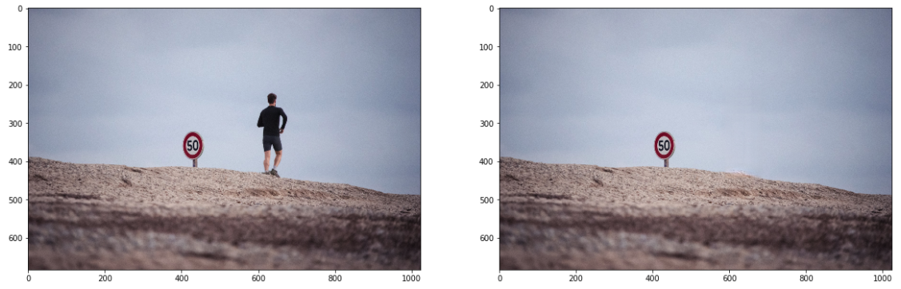
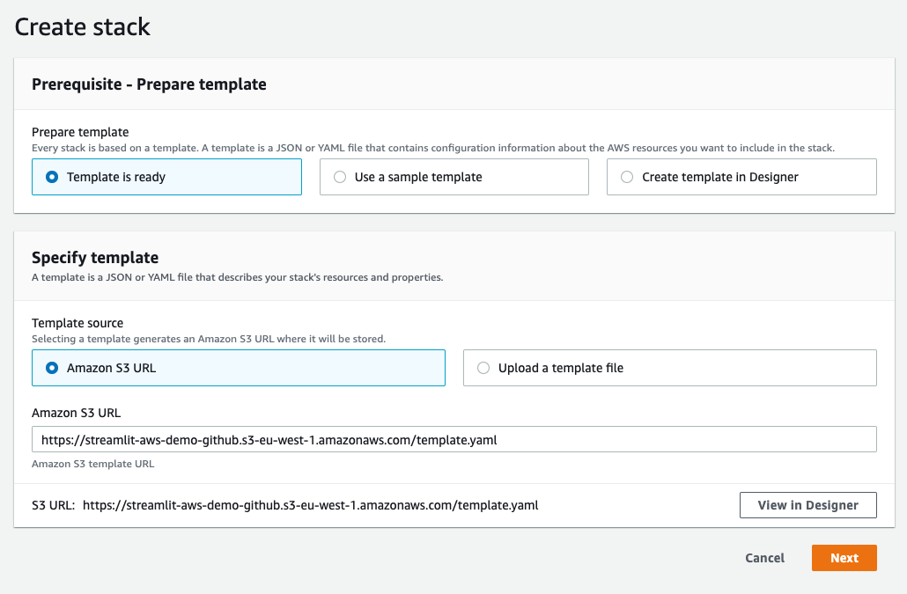
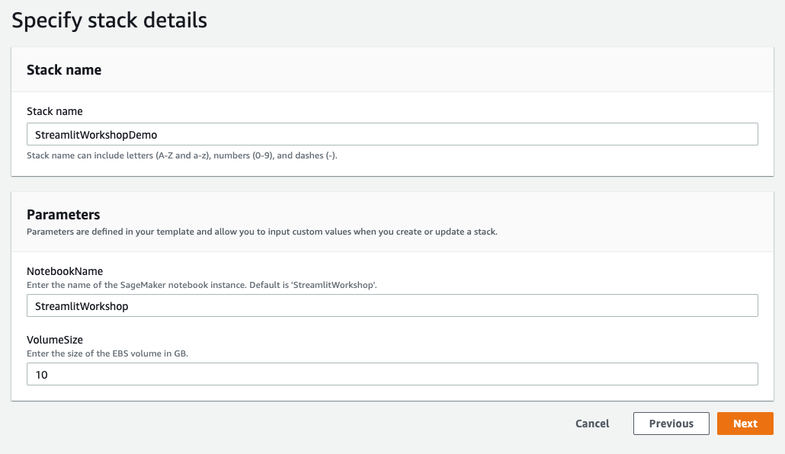
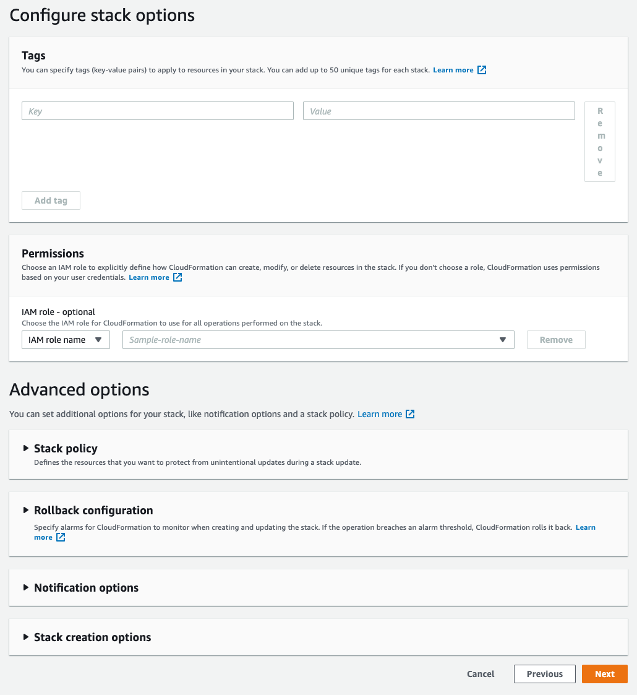
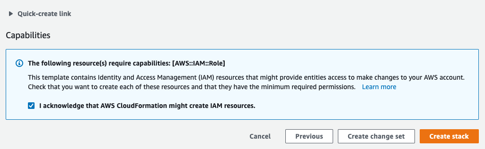
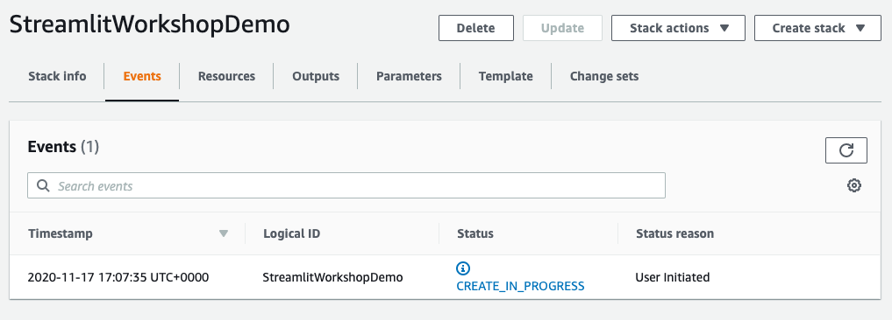
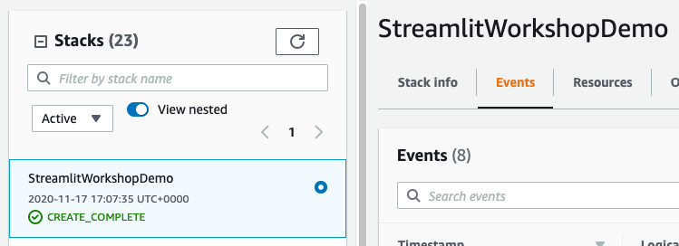
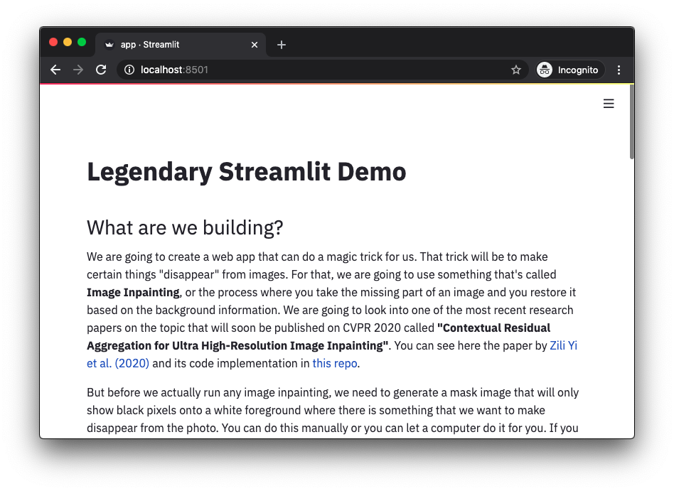
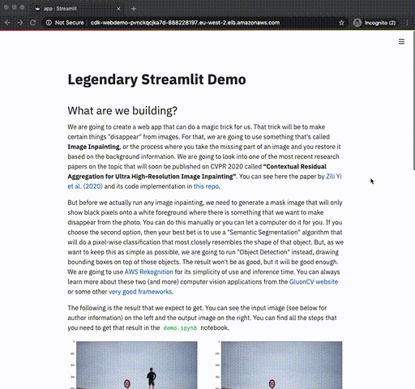

# Create beautiful and simple ML web apps that you can deploy at scale in a few steps
This repo will teach you how to build an ML-powered web app from scratch and deploy at scale to AWS Fargate from start to finish using [Streamlit](https://www.streamlit.io/) and [AWS CDK](https://docs.aws.amazon.com/cdk/latest/guide/home.html).

## What are we going to build?
We are going to create a web app that can do a magic trick for us. That trick will be to make certain things "disappear" from images. For that, we are going to use something that's called **Image Inpainting**, or the process where you take the missing part of an image and you restore it based on the background information. We are going to look into one of the most recent research papers on the topic that will soon be published on CVPR 2020 called **"Contextual Residual Aggregation for Ultra High-Resolution Image Inpainting"**. You can read the paper in arXiv by [Zili Yi et al. (2020)](https://arxiv.org/abs/2005.09704) and see its code implementation in [this repo](https://github.com/Atlas200dk/sample-imageinpainting-HiFill).

But before we actually run any image inpainting, we need to generate a mask image that will only show black pixels onto a white foreground where there is something that we want to make disappear from the photo. You can do this manually or you can let a computer do it for you. If you choose the second option, then your best bet is to use a "Semantic Segmentation" algorithm that will do a pixel-wise classification that most closely resembles the shape of that object. But, as we want to keep this as simple as possible, we are going to run "Object Detection" instead, drawing bounding boxes on top of these objects. The result won't be as good, but it will be good enough. We are going to use [AWS Rekognition](https://aws.amazon.com/rekognition/) for its simplicity of use and inference time. You can always learn more about these two (and more) computer vision applications from the [GluonCV website](https://gluon-cv.mxnet.io/contents.html) or some other [very good frameworks](https://github.com/facebookresearch/detectron2).

The following is the result that we expect to get. You can see the input image (see below for author information) on the left and the output image on the right. You can find all the steps that you need to get that result in the `demo.ipynb` notebook.



But, what if we want to build something that's more interactive, dynamic, easy to debug, and great for sharing models and results with non-technical people? There are options out there that can you help with this, such as Jupyter Voila and Plotly Dash, but none of them really does all of these at the same time. That's when I started to look into [Streamlit](https://www.streamlit.io/), an open source app framework that runs in Python and lets you create web apps that look great with very little dev work. I won't get into too much detail on what Streamlit is and how it works, but you can see a lot of examples and demos [here](https://awesome-streamlit.org/) and some best practices [here](https://pmbaumgartner.github.io/streamlitopedia/front/introduction.html).

## TL;DR
### AWS
After you have launched your CF stack, open a new terminal within the `StreamlitWorkshop` SageMaker Notebook, and run:
```
$ cd SageMaker/legendary-streamlit-demo/cdk
$ docker build -t demo/magic-trick app/
$ pip install -r requirements.txt
$ pip install aws_cdk.aws_ec2 aws_cdk.aws_ecs aws_cdk.aws_ecs_patterns
$ npm install -g aws-cdk
$ cdk synth
$ cdk bootstrap aws://unknown-account/unknown-region (if you face an error with the AWS Region)
$ cdk deploy
```
In order to avoid any unwanted cost, you can run `cdk destroy` to remove all created resources.

### Local
Clone the tutorial and `cd` into it
```
$ git clone https://github.com/nicolasmetallo/legendary-streamlit-demo
$ cd legendary-streamlit-demo
```
`Optional` build image and run locally for debugging
```
$ cd cdk/app
$ docker build -t demo/magic-trick .
$ docker run -it --rm -p '8501:8501' demo/magic-trick
```
Setup your aws credentials, install and configure aws cdk
```
$ cd ..
$ aws configure
$ npm install -g aws-cdk
$ python3 -m venv .env
$ source .env/bin/activate
$ pip install -r requirements.txt
$ pip install aws_cdk.aws_ec2 aws_cdk.aws_ecs aws_cdk.aws_ecs_patterns
```
Deploy
```
$ cdk synth
$ cdk deploy
```

Delete your stack (stop any unexpected expenses)
```
$ cdk destroy
```

## Build your environment directly on AWS
### Environment pre-requisites
This only applies if you are deploying with the `CloudFormation` template, otherwise consult the IAM permissions needed for your specific task.

- AWS Account
- User with administrator access to the AWS Account

### Build your environment
You will deploy a `CloudFormation` template that will do most of the initial setup for you. You need to be logged into your AWS account before you can run this so it will ask you for your credentials when you click the button below. Once you do that, a process will start that will deploy each item via `CloudFormation`.

[](https://console.aws.amazon.com/cloudformation/home#/stacks/new?stackName=StreamlitWorkshop&templateURL=https://raw.githubusercontent.com/nicolasmetallo/legendary-streamlit-demo/master/cloudformation/template.yaml)

Have a look at these screenshots if you have any question

<details>
  <summary>Click to expand the CF instructions</summary>

## `CloudFormation` Wizard

Start by clicking `Next` at the bottom:



In the next page you can choose your own names for the Stack and SageMaker notebook or use the default values. After you are happy with the parameters set, click `Next` again.



You don't need to fill out anything on this page as this is optional. You can scroll to the bottom and click `Next`.



Check the box to enable the template to create new IAM resources and then click `Create Stack`.



For a few minutes `CloudFormation` will be creating the resources described above on your behalf and your Console should look like this while it is provisioning:



Once it has completed you'll see `CREATE_COMPLETE` in green indicating that the work has been completed:



Now you can browse to `SageMaker`, into `Notebook Instances`, and open your new Notebook. 

</details>

## Getting started

Every person has their own way of going around these type of projects but what works best for me is to follow a lean methodology where I can design/build, measure, and learn fast. These are the steps that I normally do:

- Create a demo notebook that proves that I can do what I'm hoping to get done, e.g. take an input image and generate an inpainted image output
- Create a Streamlit application that will wrap the same steps that the demo notebook does.
- Fit everything inside an AWS CDK project to get ready for deployment.

I won't go into much detail about the first step, but I will dive deeper into how you build an Streamlit application and, once you know that's working, how you fit your project to deploy at scale.

### Requirements

- AWS Account
- [AWS CDK](https://docs.aws.amazon.com/cdk/latest/guide/getting_started.html)
- [AWS CLI](https://docs.aws.amazon.com/cli/latest/userguide/install-cliv2.html)
- Docker

## 1) Create Demo notebook

Go to your Terminal and clone this repository

```
$ git clone https://github.com/nicolasmetallo/legendary-streamlit-demo
```

Now, `cd` into `cdk/app` and you will find `demo.ipynb`. Install all dependencies and run code inside the notebook.

```
$ cd cdk/app
$ pip install -r requirements.txt
```

## 2) Create your Streamlit application

### Project structure

```bash
.
├── LICENSE
├── README.md
└── cdk
    ├── README.md
    ├── app
    │   ├── Dockerfile
    │   ├── app.py
    │   ├── demo.ipynb
    │   ├── helpers.py
    │   ├── requirements.txt
    │   ├── src
    │   │   ├── input_img.png
    │   │   ├── local_container.png
    │   │   └── magic_trick.png
    │   └── test_images
    │       ├── image_1.jpg
    │       ├── image_2.jpg
    │       ├── image_3.jpg
    │       ├── image_4.jpg
    │       ├── image_5.jpg
    │       └── image_6.jpg
    ├── app.py
    ├── cdk
    │   ├── __init__.py
    │   └── cdk_stack.py
    ├── cdk.json
    ├── requirements.txt
    └── setup.py
```

### Main sections of your Streamlit app

Our application will basically read an input image from different sources (URL, example library, user upload), generate an inpainted image and, finally, plot both together side by side. 

The first thing we want to do is to import dependencies and helper functions. Peter Baumgartner has written a nice article [here](https://pmbaumgartner.github.io/streamlitopedia/refactoring-and-writing-modular-code.html) on refactoring and writing modular code that should help you organise your code better.

#### Helper functions (as imports)

```python
from helpers import InPainting
magic_trick = InPainting()
```

#### Helper functions (within `app.py`)

```python
def show_images(input_img, output_img):
    f = plt.figure(figsize=(20,20))
    f.add_subplot(1,2,1)
    plt.imshow(input_img)
    f.add_subplot(1,2,2)
    plt.imshow(output_img)
    plt.show(block=True)
    st.pyplot(bbox_inches='tight')
```

#### Read your input image

```python
   st.header('Read image')
    st.image(
        'src/input_img.png',
        caption='Illustration by https://blush.design/artists/vijay-verma',
        use_column_width=True,
    )
    options = st.radio('Please choose any of the following options',
        (
            'Choose example from library',
            'Download image from URL',
            'Upload your own image',
        )
    )

    input_image = None
    if options == 'Choose example from library':
        image_files = list(sorted([x for x in Path('test_images').rglob('*.jpg')]))
        selected_file = st.selectbox(
            'Select an image file from the list', image_files
        )
        st.write(f'You have selected `{selected_file}`')
        input_image = Image.open(selected_file)
    elif options == 'Download image from URL':
        image_url = st.text_input('Image URL')
        try:
            r = requests.get(image_url)
            input_image = Image.open(io.BytesIO(r.content))
        except Exception:
            st.error('There was an error downloading the image. Please check the URL again.')
    elif options == 'Upload your own image':
        uploaded_file = st.file_uploader("Choose file to upload")
        if uploaded_file:
            input_image = Image.open(io.BytesIO(uploaded_file.read()))
            st.success('Image was successfully uploaded')

    if input_image:
        st.image(input_image, use_column_width=True)
        st.info('''
        Image will be resized to fit within `(1024,1024)`
        pixels for easier processing.
        ''')
    else:
        st.warning('There is no image loaded.')
```

#### Run your model inference on the image

```python
    st.header('Run prediction')
    st.write('')
    prediction_checkbox = st.checkbox('Do a magic trick!')
    if input_image and prediction_checkbox:
        try:
            with st.spinner():
                output_image = magic_trick.run_main(input_image)
                show_images(input_image, output_image)
        except Exception as e:
            st.error(e)
            st.error('There was an error processing the input image')
```

#### `Helpers.py`

For us to generate an inpainted image, we need the input image and a masked image where every pixel is white except where our target is. As mentioned before, we are going to use AWS Rekognition to detect an object and a custom Class to create a masked image from that detection.

```python
class Rekognition:
    def __init__(self):
        self.client = boto3.client(
            'rekognition',
            region_name = 'eu-west-2', # not needed
            )

    def predict_labels(self, image_bytes, max_labels=10, min_conf=90):
        response = self.client.detect_labels(
            Image = {'Bytes': image_bytes},
            MaxLabels = max_labels,
            MinConfidence = min_conf,
            )
        return response['Labels']
    
    def return_mask_img(self, image_bytes):
        image = Image.open(io.BytesIO(image_bytes))
        imgWidth, imgHeight = image.size
        blank = Image.new('RGB', image.size, (255, 255, 255))
        draw = ImageDraw.Draw(blank)
        response = self.predict_labels(image_bytes)
        
        for idx, label in enumerate(response):
            name = label['Name']
            instances = label['Instances']

            if len(instances) == 0: continue
            for instance in instances:
                confidence = instance['Confidence']
                box = instance['BoundingBox']
                left = imgWidth * box['Left']
                top = imgHeight * box['Top']
                width = imgWidth * box['Width']
                height = imgHeight * box['Height']

                points = (
                    (left, top),
                    (left + width, top),
                    (left + width, top + height),
                    (left , top + height),
                    (left, top),
                )

                # draw bounding box
                draw.rectangle([left, top, left + width, top + height], fill='black')
                
        return blank
```

Once we have both images, we should be able to run the image inpainting model prediction.

```python
class InPainting:
    def __init__(self):
        self.rekognition = Rekognition() 
        self.multiple = 6
        self.INPUT_SIZE = 512  # input image size for Generator
        self.ATTENTION_SIZE = 32 # size of contextual attention
        
    def PIL_to_cv2(self, pil_img):
        np_img = np.array(pil_img.convert('RGB'))
        return cv2.cvtColor(np_img, cv2.COLOR_RGB2BGR)
    
    def PIL_to_image_bytes(self, img):
        buffer = io.BytesIO()
        img.save(buffer, format='JPEG')
        return buffer.getvalue()
    
    def cv2_to_PIL(self, cv2_im):
        cv2_im = cv2.cvtColor(cv2_im, cv2.COLOR_BGR2RGB)
        return Image.fromarray(cv2_im)
                
    def run_main(self, input_image, max_size = (1024,1024)):
        with tf.Graph().as_default():
            with open('sample-imageinpainting-HiFill/GPU_CPU/pb/hifill.pb', "rb") as f:
                output_graph_def = tf.GraphDef()
                output_graph_def.ParseFromString(f.read())
                tf.import_graph_def(output_graph_def, name="")

            with tf.Session() as sess:
                init = tf.global_variables_initializer()
                sess.run(init)
                image_ph = sess.graph.get_tensor_by_name('img:0')
                mask_ph = sess.graph.get_tensor_by_name('mask:0')
                inpainted_512_node = sess.graph.get_tensor_by_name('inpainted:0')
                attention_node = sess.graph.get_tensor_by_name('attention:0')
                mask_512_node = sess.graph.get_tensor_by_name('mask_processed:0')
        
                input_image.thumbnail(max_size)
                image_bytes = self.PIL_to_image_bytes(input_image)
                raw_mask = self.PIL_to_cv2(self.rekognition.return_mask_img(image_bytes))
                raw_img = self.PIL_to_cv2(input_image)
                inpainted = self.inpaint(
                            raw_img, raw_mask, sess, inpainted_512_node, 
                            attention_node, mask_512_node, image_ph, mask_ph, self.multiple)
                return self.cv2_to_PIL(inpainted)
```

### Test your application
By default Streamlit is installed in `python3` virtual environment. Start Streamlit server by running the following command in notebook terminal:
- source activate python3
- streamlit run app.py

You can now access your Streamlit web app using the URL `{base_url}/proxy/{port}/` in a browser. With a slash at the end.
For example: https://{notebookname}.notebook.{region}.sagemaker.aws/proxy/8501/

### Create `Dockerfile`

```dockerfile
FROM python:3.7
EXPOSE 8501
WORKDIR /app
COPY requirements.txt ./requirements.txt
RUN pip3 install -r requirements.txt

COPY . .
CMD streamlit run app.py \
    --server.headless true \
    --browser.serverAddress="0.0.0.0" \
    --server.enableCORS false \
    --browser.gatherUsageStats false
```

### Build image and run locally or in AWS for debugging

Run the following command in your Terminal inside `./cdk/app` to build your container image

```
$ docker build -t demo/magic-trick .
```

Now run the container

```
$ docker run -it --rm -p '8501:8501' demo/magic-trick
```

And if you open your browser and go to `http://localhost:8501/` or `https://{notebookname}.notebook.{region}.sagemaker.aws/proxy/8501/`, you should be able to see the following... **Success!** :smiley:



## 3) Deploy your `Streamlit` app to `AWS Fargate` using `AWS CDK`

### Quick intro

**AWS CDK** is a software development framework for defining cloud infrastructure in code and provisioning it through **AWS CloudFormation** that enables you to:

- Create and provision AWS infrastructure deployments predictably and repeatedly.
- Leverage AWS products such as Amazon EC2, Amazon Elastic Block Store, Amazon SNS, Elastic Load Balancing, and Auto Scaling.
- Build highly reliable, highly scalable, cost-effective applications in the cloud without worrying about creating and configuring the underlying AWS infrastructure.
- Use a template file to create and delete a collection of resources together as a single unit (a stack).

**AWS Fargate** is a compute engine for Amazon ECS and EKS that allows you to run containers without having to manage servers or clusters. We are going to use both services to easily deploy our containers at scale.

If you didn't understand all of that, don't worry too much about it, as there's a nice [Getting Started](https://docs.aws.amazon.com/cdk/latest/guide/getting_started.html) guide that you can follow and there's also the [official Python Reference documentation](https://docs.aws.amazon.com/cdk/api/latest/python/index.html) for you to check. I'm going to list every step you need to do following the official [ECS example](https://docs.aws.amazon.com/de_de/cdk/latest/guide/ecs_example.html) but because most of these steps are already done within this repo (e.g. create project directory), feel free to just initialise the AWS CDK and install all dependencies before you skip ahead to **Deploy your stack** below.

### Configure your AWS credentials

If you are going to deploy your stack from your local machine, you should make sure that your AWS credentials are properly set in your environment. You can read more about that in the [docs](https://docs.aws.amazon.com/cli/latest/userguide/cli-configure-files.html).

Open your terminal and run the following. When asked, add your access and secret keys.

```bash
$ aws configure
```

If you, on the other hand, are going to deploy your stack from an AWS instance (e.g. EC2, SageMaker, etc.) then your environment will take the credentials and role that you have assigned to that instance, and you don't need to configure anything. You just need to double check that your role can you everything you want to do.

### Install `AWS CDK`

Go to your Terminal and install the AWS CDK using the following command.

```bash
$ npm install -g aws-cdk
```

(optional) If you need to update your AWS CDK version, run

```bash
$ npm update -g aws-cdk
```

Run the following command to verify correct installation and print the version number of the AWS CDK.

```bash
$ cdk --version
```

### Update your language dependencies

If you get an error message that your language framework is out of date, use one of the following commands to update the components that the AWS CDK needs to support the language.

```bash
$ pip install --upgrade aws-cdk.core
```

### Create your project directory and initialise the AWS CDK

Let's start by creating a directory to hold the AWS CDK code, and then creating a AWS CDK app in that directory.

```
$ mkdir cdk
$ cd cdk
$ cdk init --language python
$ source .env/bin/activate
$ pip install -r requirements.txt
```

Your generated `cdk/cdk_stack.py` should look something like this.

```python
from aws_cdk import core


class CdkStack(core.Stack):

    def __init__(self, scope: core.Construct, id: str, **kwargs) -> None:
        super().__init__(scope, id, **kwargs)

        # The code that defines your stack goes here
```

Build and run the app and confirm that it creates an empty stack.

```
$ cdk synth
```

You should see a stack like the following, where `CDK-VERSION` is the version of the CDK and `NODE-VERSION` is the version of Node.js. (Your output may differ slightly from what's shown here.)

```
Resources:
  CDKMetadata:
    Type: AWS::CDK::Metadata
    Properties:
      Modules: aws-cdk=CDK-VERSION,@aws-cdk/core=CDK-VERSION,@aws-cdk/cx-api=CDK-VERSION,jsii-runtime=node.js/NODE-VERSION
```

### Add the Amazon EC2 and Amazon ECS packages

Install the AWS construct library modules for Amazon EC2 and Amazon ECS.

```bash
$ pip install aws_cdk.aws_ec2 aws_cdk.aws_ecs aws_cdk.aws_ecs_patterns
```

### Create a Fargate service

There are two different ways to run your container tasks with Amazon ECS:

- Use the `Fargate` launch type, where Amazon ECS manages the physical machines that your containers are running on for you.
- Use the `EC2` launch type, where you do the managing, such as specifying automatic scaling.

For this example, we'll create a Fargate service running on an ECS cluster fronted by an internet-facing Application Load Balancer. On top of this, we are going to add auto-scaling to this cluster and attach policies to the Task Role for the container to be able to use AWS Rekognition.

Add the following AWS Construct Library module imports to the indicated file.

File: `cdk/cdk_stack.py`

```python
from aws_cdk import (
    aws_ec2 as ec2,
    aws_ecs as ecs,
    aws_ecr as ecr,
    aws_iam as iam,
    aws_ecs_patterns as ecs_patterns,
    core,
)
```

Replace the comment at the end of the constructor with the following code.

```python
        # Create a VPC
        vpc = ec2.Vpc(
            self, "WebDemoVPC", 
            max_azs = 2,
            )     # default is all AZs in region, 
                  # but you can limit to avoid reaching resource quota

        # Create ECS cluster
        cluster = ecs.Cluster(self, "WebDemoCluster", vpc=vpc)

        # Add an AutoScalingGroup with spot instances to the existing cluster
        cluster.add_capacity("AsgSpot",
            max_capacity=2,
            min_capacity=1,
            desired_capacity=2,
            instance_type=ec2.InstanceType("c5.xlarge"),
            spot_price="0.0735",
            # Enable the Automated Spot Draining support for Amazon ECS
            spot_instance_draining=True
        )

        # Build Dockerfile from local folder and push to ECR
        image = ecs.ContainerImage.from_asset('app')

        # Create Fargate service
        fargate_service = ecs_patterns.ApplicationLoadBalancedFargateService(
            self, "WebDemoService",
            cluster=cluster,            # Required
            cpu=512,                    # Default is 256 (512 is 0.5 vCPU)
            desired_count=1,            # Default is 1
            task_image_options=ecs_patterns.ApplicationLoadBalancedTaskImageOptions(
                image=image, 
                container_port=8501,
                ),
            memory_limit_mib=2048,      # Default is 512
            public_load_balancer=True)  # Default is True

        # Add policies to task role
        fargate_service.task_definition.add_to_task_role_policy(iam.PolicyStatement(
            effect=iam.Effect.ALLOW,
            actions = ["rekognition:*"],
            resources = ["*"],
            )
        )

        # Setup task auto-scaling
        scaling = fargate_service.service.auto_scale_task_count(
            max_capacity=10
        )
        scaling.scale_on_cpu_utilization(
            "CpuScaling",
            target_utilization_percent=50,
            scale_in_cooldown=core.Duration.seconds(60),
            scale_out_cooldown=core.Duration.seconds(60),
        )
```

A few things to consider while you are setting up your AWS CDK Python script

- Fargate Spot instances are not yet supported in CloudFormation (as of 31/5/2020)
- A Task Execution Role is different to a Task Role. Basically, the execution role is the role that executes ECS actions such as pushing and pulling the image, and the task role is the role used by the task itself that calls other AWS services such as Rekognition, S3, etc. Read more about this in the [StackOverflow question](https://stackoverflow.com/questions/48999472/difference-between-aws-elastic-container-services-ecs-executionrole-and-taskr).
- We have set up an ECS cluster with an Auto Scaling Group with spot instances and also the possibility of starting up to 10 new tasks as cpu utilisation increases above 50%. You can read more about task auto-scaling [here](https://docs.aws.amazon.com/cdk/api/latest/python/aws_cdk.aws_ecs.README.html#task-auto-scaling). 
- Instead of building and pushing your container image to ECR every time you want to deploy your project, you could also pull an existing image that you have in your ECR Repository. You can do that with

```python
repository = ecr.Repository.from_repository_arn(
        self, "{repository-name}",
        "arn:aws:ecr:{region-name}:{account-id}:repository/{repository-name}")
    image = ecs.ContainerImage.from_ecr_repository(repository=repository, tag="latest")     
```

### Deploy your stack

When your app has a single stack, there is no need to specify the stack name, and you can run

```bash
$ cdk deploy
```

If you get an error such as

```bash
This stack uses assets, so the toolkit stack must be deployed to the environment (Run "cdk bootstrap aws://unknown-account/unknown-region")
```

Then you need to bootstrap the account used by your default profile before you run `cdk deploy`.

```bash
$ cdk bootstrap
...
✅  Environment aws://{your-account-id}/{your-region-name} bootstrapped.
```

The whole process should take anywhere from 10 to 20 minutes as we are also pushing our container image to ECR. Once the process has succesfully ended, you should see something like this:

```bash
✅  cdk

Outputs:
cdk.WebDemoServiceLoadBalancerDNS******A5 = cdk-WebDemo-PV******KA7D-******197.eu-west-2.elb.amazonaws.com
cdk.WebDemoServiceServiceURL******7B = http://cdk-WebDemo-PV******KA7D-******197.eu-west-2.elb.amazonaws.com

Stack ARN:
arn:aws:cloudformation:eu-west-2:************:stack/cdk/c7f457f0-a34d-11ea-a167-******e602c
```

Now when you open your browser and go to the `cdk.WebDemoServiceServiceURL` you will see your application. Please note that as we have assigned only 0.5 vCPU to the task, the inference time will be quite long, between 20 to 30 seconds. But you can always go back, change this, and re-deploy with `cdk deploy`.



**Congratulations! Your app is now online** :smiley:

### Delete your AWS CDK project

If you no longer want your app to be out there, you might want to clear everything that was setup by AWS CDK to avoid incurring into any unexpected cost.

```bash
$ cdk destroy
```

## Community Updates

- Zeph Grunschlag has taken this repo and made into a "one-click" deployment. [Check it out!](https://github.com/tzaffi/streamlit-cdk-fargate).

## References

- Yi, Z., Tang, Q., Azizi, S., Jang, D., & Xu, Z. (2020). Contextual Residual Aggregation for Ultra High-Resolution Image Inpainting. *arXiv preprint arXiv:2005.09704*.

**Images included in the `test_images` folder**

| Filename      | Author                | Source                                          |
| ------------- | --------------------- | ----------------------------------------------- |
| `image_1.jpg` | Tim Doerfler          | [Link](https://unsplash.com/photos/dQT6hKtRWRw) |
| `image_2.jpg` | Barthelemy de Mazenod | [Link](https://unsplash.com/photos/iw0SowaRxeY) |
| `image_3.jpg` | Donald Giannatti      | [Link](https://unsplash.com/photos/E9AyOAQL2R4) |
| `image_4.jpg` | hanya kumuh           | [Link](https://unsplash.com/photos/vNVPAKf1GO4) |
| `image_5.jpg` | Guillaume de Germain  | [Link](https://unsplash.com/photos/h1itWfWeQM4) |
| `image_6.jpg` | Timur Romanov         | [Link](https://unsplash.com/photos/YgoLFkdrD8Q) |

## Disclaimer
- The content provided in this repository is for demonstration purposes and not meant for production. You should use your own discretion when using the content.
- The ideas and opinions outlined in these examples are my own and do not represent the opinions of AWS.
